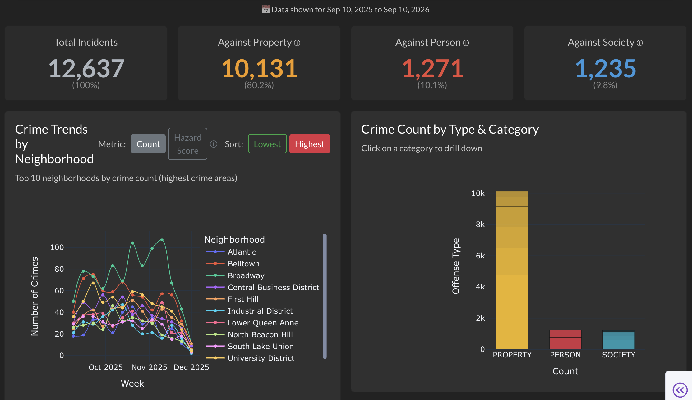
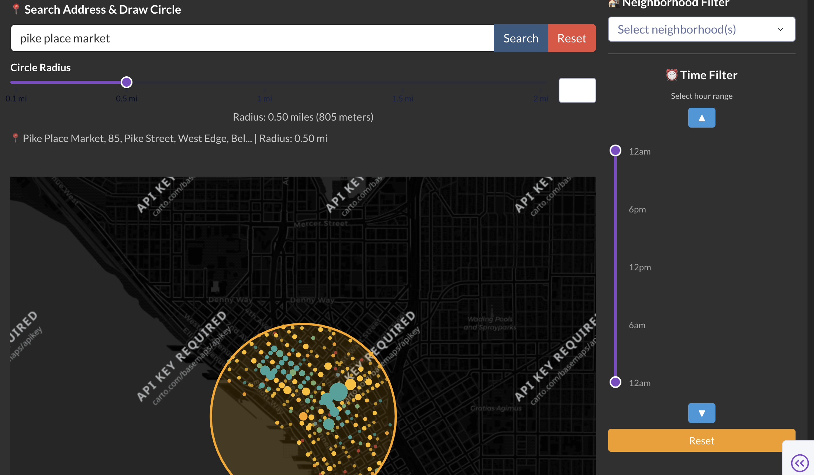

# WatchDawg: Seattle Crime Analytics Dashboard

An interactive web dashboard for exploring Seattle crime incident data, built with
[Dash](https://dash.plotly.com/) and backed by a SQLite database. The dashboard
lets users filter incidents by date, time of day, neighborhood, and crime category,
and visualizes the results through KPI cards, trend charts, a drill-down bar chart,
and an interactive map.

**Course:** DATA 511 - Data Visualization

**Team WatchDawg:** Doyoung Jung, Wonjoon Hwang, Aneesh Singh, DH Lee, Jungmoon Ha, Jonathan Langley Grothe, Derek Tropf

---

## Table of Contents

1. [Running the App](#running-the-app)
2. [Screenshots](#screenshots)
3. [Project Overview](#project-overview)
4. [Features](#features)
5. [Tech Stack](#tech-stack)
6. [Project Structure](#project-structure)
7. [Getting Started](#getting-started)
8. [Usage Guide](#usage-guide)
9. [Data Source](#data-source)
10. [Data Cleaning and Preprocessing](#data-cleaning-and-preprocessing)
11. [Database Schema](#database-schema)
12. [Architecture Notes](#architecture-notes)
13. [Design Rationale](#design-rationale)
14. [Deployment](#deployment)
15. [Troubleshooting](#troubleshooting)
16. [License and Acknowledgments](#license-and-acknowledgments)

---

## Running the App

> **Note:** The previously hosted demo (`https://watchdawg-app.onrender.com/`) is
> **currently unavailable**. Please run the dashboard locally using the steps below.

Quick start (assumes Python 3.11+ is installed):

```bash
# 1. Move into the project folder
cd watchdawg_app

# 2. (Recommended) Create and activate a virtual environment
python3 -m venv venv
source venv/bin/activate          # Windows: venv\Scripts\activate

# 3. Install dependencies
pip install -r requirements.txt

# 4. Run the app (downloads the database from Google Drive on first run)
python app.py
```

Then open **http://localhost:8050** in your browser. Press `Ctrl+C` in the terminal
to stop the server. See [Getting Started](#getting-started) for more detail,
including how to provide the database manually.

---

## Screenshots

### Dashboard Overview

KPI cards, neighborhood crime trends, and the crime-type drill-down chart.



### Interactive Map with Address Search and Radius

Search an address, draw a radius circle, and explore incident points by category
and time of day.



---

## Project Overview

Seattle residents, students, and visitors often want to understand the safety
profile of a neighborhood, but public crime data is large, raw, and hard to
interpret. WatchDawg turns the Seattle Police Department's incident records into an
interactive dashboard that answers practical questions such as:

- How does crime volume vary across neighborhoods and over time?
- What types of crime are most common in a given area?
- What does the incident distribution look like within walking distance of a
  specific address?
- How do patterns change by time of day?

The interface is designed to give users an immediate spatial overview and then let
them progressively narrow the data with a small set of intuitive filters.

---

## Features

- **Date Range Filter** - select a custom date range that drives every view on the page.
- **KPI Cards** - total incidents plus a breakdown of crimes against Property, Person, and Society, each with its share of the total.
- **Neighborhood Trend Chart** - line chart of the top or bottom 10 neighborhoods, ranked either by crime count or by an opinionated Hazard Score; time is aggregated by day, week, or month depending on the selected range.
- **Crime Type Bar Chart** - stacked bar chart of categories with sub-categories; click a category to drill down into its sub-categories and use "Back" to return.
- **Interactive Map** - Plotly map of incident points colored by category, with marker size scaled to how many incidents occur at the same location.
- **Address Search and Radius** - geocode a Seattle address and draw a circle of an adjustable radius (0.1-2 miles) to filter incidents near that point.
- **Time-of-Day Filter** - vertical range slider to restrict incidents to an hour window, with shift-earlier/later controls.
- **Neighborhood Filter** - multi-select dropdown populated from the data.
- **Crime Category Filter** - toggle Person / Property / Society.
- **Details Table** - sortable, filterable, paginated table of the 500 most recent matching incidents.

---

## Tech Stack

| Layer          | Technology                                              |
| -------------- | ------------------------------------------------------- |
| Web framework  | Dash (Flask under the hood)                             |
| UI components  | dash-bootstrap-components, dash-mantine-components      |
| Visualization  | Plotly                                                  |
| Data handling  | pandas, numpy                                           |
| Storage        | SQLite                                                  |
| Geocoding      | OpenStreetMap Nominatim API                             |
| Deployment     | Render (Gunicorn)                                       |
| File transfer  | gdown / requests (Google Drive download)               |

---

## Project Structure

```
watchdawg_app/
├── app.py                  # Main Dash application (layout + callbacks)
├── convert_to_sqlite.py    # Converts crime_data_gold.csv -> crime_data_gold.db
├── Data Cleaning.ipynb     # Data cleaning and preprocessing notebook
├── requirements.txt        # Python dependencies
├── render.yaml             # Render deployment configuration
├── assets/                 # Logo images and custom CSS (auto-served by Dash)
└── README.md
```

> The SQLite database (`crime_data_gold.db`) is **not** committed to the repository.
> It is downloaded from Google Drive at runtime, or you can generate it locally from
> the source CSV using `convert_to_sqlite.py`.

---

## Getting Started

### Prerequisites

- Python 3.11 or higher

### Installation

1. Clone the repository and move into the project folder:

   ```bash
   cd watchdawg_app
   ```

2. (Recommended) Create and activate a virtual environment:

   ```bash
   python3 -m venv venv
   source venv/bin/activate          # Windows: venv\Scripts\activate
   ```

3. Install dependencies:

   ```bash
   pip install -r requirements.txt
   ```

   Dependencies: `dash`, `dash-bootstrap-components`, `dash-mantine-components`,
   `pandas`, `numpy`, `plotly`, `gunicorn`, `gdown`, `requests`.

4. Provide the database. You have two options:

   - **Automatic (default):** do nothing. On startup the app downloads
     `crime_data_gold.db` from Google Drive if it is not already present in the
     project directory.
   - **Manual:** place an existing `crime_data_gold.db` next to `app.py`, or build
     it from the source CSV:

     ```bash
     # Requires crime_data_gold.csv in the same directory
     python convert_to_sqlite.py
     ```

5. Run the application:

   ```bash
   python app.py
   ```

6. Open `http://localhost:8050` in your browser. To use a different port, set the
   `PORT` environment variable (e.g. `export PORT=8051`). Press `Ctrl+C` to stop.

---

## Usage Guide

### Date Range

Open the Date Filter in the left sidebar and pick a start and end date. All KPIs,
charts, the map, and the table update to the selected range.

### Map

- Each dot is an incident, colored by category: Person (red), Property (yellow),
  Society (blue). Larger dots indicate more incidents at the same location.
- Enter a Seattle address and click **Search** to center the map and draw a radius
  circle; adjust the slider to change the radius. Click **Reset** to clear it.
- For performance, the map renders the 5,000 most recent matching incidents; the
  statistics line shows the true total when it is larger.

### Filters (right of the map)

- **Neighborhood** - select one or more neighborhoods.
- **Time of Day** - drag the vertical slider handles to set an hour window, or use
  the up/down buttons to shift the window; **Reset** restores all hours.
- **Crime Type** - check or uncheck Person / Property / Society.

### Charts

- **Neighborhood Trend** - toggle between **Count** and **Hazard Score**, and
  between **Highest** and **Lowest** neighborhoods.
- **Crime Type** - click a category bar to drill into its sub-categories; click
  **Back** to return to the overview.

### Details Table

Shows the 500 most recent incidents matching the current filters. Columns support
native sorting and filtering, and the table is paginated.

---

## Data Source

The dashboard uses Seattle Police Department crime incident data from the
[Seattle Open Data Portal](https://data.seattle.gov/Public-Safety/SPD-Crime-Data-2008-Present/tazs-3rd5/about_data),
retrieved on December 4, 2025.

All incidents follow the **National Incident Based Reporting System (NIBRS)**, which
records detailed context for each crime, including location coordinates, crime
classification, and temporal data. Neighborhood boundaries are assigned using the
official City of Seattle Neighborhood Map.

---

## Data Cleaning and Preprocessing

Raw SPD data is cleaned in `Data Cleaning.ipynb` before being loaded into SQLite.
The process includes:

1. **Missing value standardization** - replace placeholders (`-`, `REDACTED`, `-1.0`) with `NaN`.
2. **Geographic validation** - keep only coordinates within Seattle bounds (Latitude 47.0-48.1, Longitude -123.5 to -121.0).
3. **Neighborhood cleaning** - drop `UNKNOWN`, `FK ERROR`, `OOJ`, and missing neighborhoods.
4. **Crime category standardization** - remove `ANY` and `NOT_A_CRIME`; keep PERSON, PROPERTY, SOCIETY.
5. **Offense sub-category cleaning** - drop `UNKNOWN`, `999`, and empty values.
6. **Location requirements** - require coordinates, block address, reporting area, and beat.
7. **Sector cleaning** - remove `None` and `99`.
8. **Shooting type handling** - fill missing shooting type with `"No Shooting"`.
9. **Temporal processing** - derive year, month, day, time, and hour fields.
10. **Type optimization** - convert columns to appropriate numeric and string types.
11. **Column selection and renaming** - rename to dashboard-friendly names (e.g. `Block Address` → `location`, `Neighborhood` → `area`).

The result is a clean dataset with valid coordinates, complete location data, valid
classifications, and well-formed timestamps.

---

## Database Schema

The `crimes` table contains the following columns:

| Column                   | Type    | Description                             |
| ------------------------ | ------- | --------------------------------------- |
| `date`                   | DATE    | Date of the incident                    |
| `time`                   | STRING  | Time of the incident                    |
| `hour`                   | INTEGER | Hour of day (0-23)                      |
| `datetime`              | STRING  | Combined date and time                  |
| `offense`                | STRING  | Offense category                        |
| `offense_sub_category`   | STRING  | Offense sub-category                    |
| `crime_against_category` | STRING  | PERSON, PROPERTY, or SOCIETY            |
| `location`               | STRING  | Block address                           |
| `area`                   | STRING  | Neighborhood name                       |
| `precinct`               | STRING  | Police precinct                         |
| `sector`                 | STRING  | Police sector                           |
| `hazardness`             | FLOAT   | Opinionated hazard score                |
| `latitude`               | FLOAT   | Latitude coordinate                     |
| `longitude`              | FLOAT   | Longitude coordinate                    |

Indexes are created on `date`, `hour`, `area`, `crime_against_category`, and
`(latitude, longitude)` to speed up queries.

---

## Architecture Notes

The app is designed to run within Render's free tier (512 MB memory limit):

- **On-demand loading.** Data is queried from SQLite as needed rather than held
  entirely in memory.
- **Date-range queries in SQL.** The selected date range (and a coordinate
  not-null check) is pushed down to the SQL `WHERE` clause, so only rows within the
  chosen range are read from disk.
- **In-memory filtering for the rest.** Additional filters - hour window, crime
  category, neighborhood, and the address radius - are applied in pandas after the
  date-range query returns.
- **Efficient dtypes.** String columns are converted to `category` and numeric
  columns to compact types (`int8`, `float32`) after loading.

> Note: to keep memory usage predictable, the app does not cache query results, so
> changing a filter re-runs the date-range query for each affected view.

---

## Design Rationale

Our visualization was designed with a user-centered approach inspired by Cooper et
al.'s *About Face*. We recognized that users evaluate safety differently depending
on their goals, locations, and lived experiences, which led us to prioritize
intuitive navigation, simple interaction, and a design that never makes users feel
they made a "wrong" choice. Following Bertin, we encode crime locations primarily
with spatial position - the most effective visual variable - to give an instant,
low-cognitive-load snapshot of citywide patterns, while details such as crime type
and time of day are layered on through hue, size, and filters.

We deliberately limited the filters to three dimensions - neighborhood, crime type,
and hour of day. Neighborhoods match how people naturally think about location;
crime types were consolidated from 25+ raw categories into a smaller, interpretable
set; and time-of-day filtering lets users personalize risk around their daily
routines. Summary charts above the map support coordinated exploration before users
dive into spatial detail. Overall, our goal was to give users as much agency as
possible in a view that is rich in context yet simple to navigate.

---

## Deployment

The dashboard is deployed on [Render](https://render.com) using the configuration in
`render.yaml`:

- **Runtime:** Python 3.11
- **Server:** Gunicorn with 1 worker and 2 threads
- **Database:** downloaded from Google Drive on first run

### Environment Variables

- `DB_GDRIVE_URL` - Google Drive URL for the SQLite database. A default is defined in
  `app.py`; set this variable to override it.
- `DASH_DEBUG` - set to `0` for production (debug is on by default when running locally).
- `PORT` - the port to bind to (set automatically by Render).

---

## Troubleshooting

**"No data loaded" / database not found**
- Confirm `crime_data_gold.db` exists next to `app.py`, or that the app can reach the
  Google Drive URL.
- Check the application logs for download errors; a Google Drive sharing
  misconfiguration can cause an HTML page to be downloaded instead of the database.

**Memory issues**
- Narrow the date range and apply filters to reduce the amount of data loaded.

**Port already in use**
- Set a different port: `export PORT=8051 && python app.py`.

---

## License and Acknowledgments

This project was developed for educational purposes as part of **DATA 511**.

- Data: [Seattle Police Department Crime Data](https://data.seattle.gov/Public-Safety/SPD-Crime-Data-2008-Present/tazs-3rd5/about_data)
- Geocoding: [OpenStreetMap Nominatim](https://nominatim.openstreetmap.org/)
